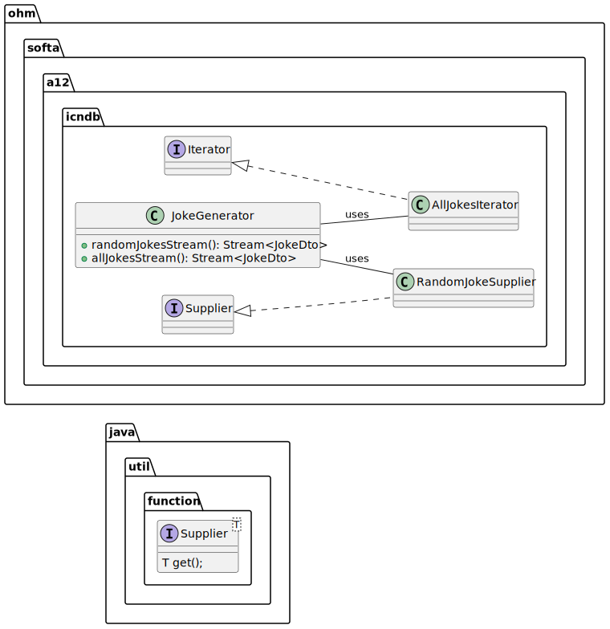
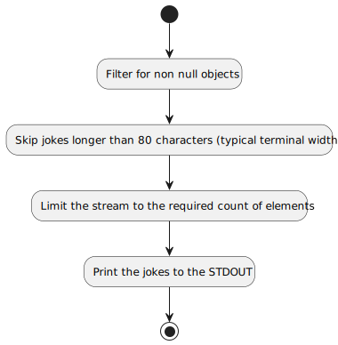

_This is an assignment to the [Software Architecture](https://ohm-softa.github.io) class at the [Technische Hochschule Nürnberg](http://www.th-nuernberg.de)._

# Assignment 12: Functional - CLI variant


This assignment covers the basics of the Java 8 `Stream` API.
Streams are a functional concept and are relatively new in Java but they are very useful in combination with all kinds of _iterable_ data sources.
Streams may look a little bit complicated but when you got the concept they improve the readability of your code because they are more _data pipeline_ oriented as normal Java code is where you always have to iterate a collection with any kind of loop.
A main point of this exercise is to understand the difference of infinite and finite streams, ie. streams that keep producing objects vs. streams that come to an end.
Here, we will generate those using `Supplier` and `Iterator` classes.

The story for this assignment is to retrieve (a number of ) jokes from the Chuck Norris Jokes Database and rework them for proper display.
The `App.java` already contains most of the boilerplate code to select a joke source (random or exhaustive), and specify how many jokes to skip or keep.


## Setup

1. Create a fork of this repository (button in the right upper corner)
1. Clone the project (get the link by clicking the green _Clone or download button_)
1. Import the project to your **IntelliJ**
1. **Read the whole assignment spec!**

_Remark: the given test suite is incomplete but will succeed after the checkout._

## Objectives

1. Implement the `RandomJokeSupplier` - this supplier returns a random joke every time it is used.
1. Implement the `AllJokesIterator` - iterates over all jokes until it finds a duplicate/collision.
1. Implement the `JokeGenerator` - the generator returns infinite and finite streams based on the implemented suppliers.
1. Complete the test suite to ensure that your generators are working correctly! (note: for the exhaustive one you may need to set a timeout).

_Note 1:_ the class structure is already there (including the empty unit tests).

_Note 2:_ the whole logic around the **CNJDB** is already implemented including the `CNJDBService` service (which manages an API singleton)!
There is no way to implement asynchronous generators, use the `get` method of the `CompletableFuture` provided by the `CNJDBApi`.

## Generators

A generator is component that creates a `Stream`.
There are two kinds of streams:

* finite
* infinite

A stream based on a list of objects is a finite stream as there are only a discrete number of elements that can be iterated.

### Infinite Streams 

An _infinite_ stream is created by providing a `Supplier<T>` instance to the `Stream.generate(...)` method like this:

```java
var prngStream = Stream.generate(new PseudoRandomNumberSupplier());
```

where `PseudoRandomNumberSupplier` is an implementation of the `Supplier<T>` interface builtin in the JDK.
See also the following complete example of how to implement the `Supplier<T>` interface and how to create an infinite stream.

Infinite streams are seaming to be a little bit weird but they are also very useful.
Think of a pseudo random number generator.
An infinite stream may be used to produce as many random numbers as required.
Here is an example that shows the implementation and usage of such a generator:

```java
public abstract class PseudoRandomNumberGenerator {

    private PseudoRandomNumberGenerator() {
    }

    public static Stream<Integer> createStream() {
        return Stream.generate(new PseudoRandomNumberSupplier());
    }

    private static class PseudoRandomNumberSupplier implements Supplier<Integer> {

        private final Random random = new Random();

        @Override
        public Integer get() {
            return random.nextInt();
        }
    }
    
    public static void main(String... args) {
		Stream<Integer> prngStream = createStream();
		prngStream
			.limit(10)
			.forEach(System.out::println);
	}
}
```

_Note that the `limit(...)` operation is mandatory because the stream is infinite and otherwise the whole operation will not terminate!_

### Finite Streams

Finite streams can be created from iterators using the `StreamSupport.stream` and `Spliterators.spliteratorUnknownSize` factory functions.
Here is an example of an iterator that produces `n` random numbers, as base for a finite stream of random numbers.

```java
class FinitePseudoRandomNumberGenerator {
	private FinitePseudoRandomNumberGenerator() {
	}

	public static Stream<Integer> createStream(int n) {
        Spliterator<Integer> it = Spliterators.spliteratorUnknownSize(new RandomIterator(n), Spliterator.DISTINCT);
		return StreamSupport.stream(it, false);
	}
    
	private static class RandomIterator implements Iterator<Integer> {
        private int n;
        private final Random random = new Random();

        public RandomIterator(int n) {
            this.n = n;
        }
		
        @Override
        public boolean hasNext() {
            return n > 0;
        }

		@Override
        public Integer next() {
            n--;
            return random.nextInt();
        }
    }
    
    public static void main(String... args) {
		Stream<Integer> prngStream = createStream(5);
		System.out.println(prngStream.count());  // 5!
	}
}
```

## Implementing the generators

In this part of the assignment you will implement two generators as shown in the following UML:



_Remark: the UML is incomplete and is meant as implementation hint!_


## Using the generators

The given class `App` already implements a basic _CLI_ interface.
To complete the assignment implement the required code marked with a _TODO_.

The following flow diagram explains how to use the `jokesSource`:



Every chart element corresponds to a single method call on the stream of jokes.
For further reading about the Java 8 streams have a look at [this article](http://winterbe.com/posts/2014/07/31/java8-stream-tutorial-examples/).

_Remark: this part is technically a one-liner. To improve the readability add line breaks after every stream transformation. That should result in 5-6 lines of code._
